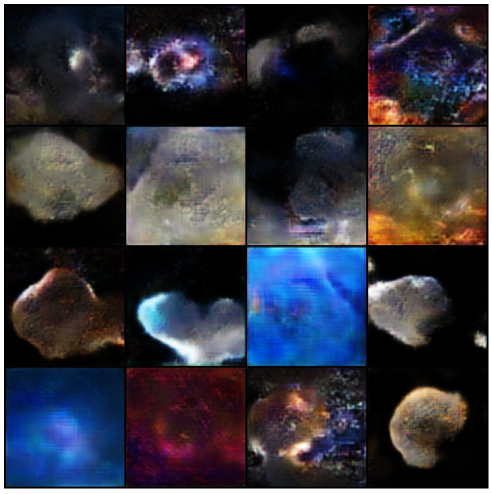

# Cosmos GAN – WGAN-GP for Astronomical Image Generation

This project implements a Wasserstein GAN with Gradient Penalty (WGAN-GP) trained on a dataset of astronomical images. The objective is to generate synthetic cosmic structures such as nebula-like formations, diffuse clouds, and other visually coherent astrophysical patterns.

## Description

The model is composed of a generator that maps a latent noise vector into a 128×128 RGB image, and a critic that evaluates the realism of both real and generated samples. Unlike classic GANs, WGAN-GP replaces the Jensen–Shannon divergence with the Wasserstein-1 distance, which greatly stabilizes training and improves gradient flow.

Images in the dataset are preprocessed through resizing, center cropping, normalization, and loading through a custom PyTorch Dataset. Training alternates between multiple critic updates and one generator update per iteration, following the WGAN-GP procedure.

The generator progressively upsamples the latent space into a spatial structure through convolutional blocks, while the critic uses deep convolutional layers to assess the Wasserstein score of input images. Generated samples are saved after each epoch for visual inspection.

## Mathematical Overview

Let \(P_{\text{real}}\) denote the data distribution of real images and \(P_{\text{fake}}\) the distribution induced by the generator. The critic \(D\) is trained to approximate the Wasserstein-1 distance between these two distributions:

$$
\
W(P_{\text{real}}, P_{\text{fake}}) \approx \mathbb{E}_{x \sim P_{\text{real}}}[D(x)] - \mathbb{E}_{\tilde{x} \sim P_{\text{fake}}}[D(\tilde{x})]
\
$$

To enforce the 1-Lipschitz constraint required by the Wasserstein theory, WGAN-GP adds a gradient penalty. We define interpolated samples

$$
\
\hat{x} = \alpha x_{\text{real}} + (1 - \alpha) x_{\text{fake}}
\quad \alpha \sim \mathcal{U}(0, 1)
\
$$

and the gradient penalty term

$$
\
\text{GP} = \lambda \, \mathbb{E}_{\hat{x}}\big[ \big(\lVert \nabla_{\hat{x}} D(\hat{x}) \rVert_2 - 1 \big)^2 \big]
\
$$

The critic loss is then

$$
\
\mathcal{L}_{\text{critic}} = \mathbb{E}_{\tilde{x} \sim P_{\text{fake}}}[D(\tilde{x})]
\mathbb{E}_{x \sim P_{\text{real}}}[D(x)] + \text{GP}
\
$$

which is minimized during training. The generator is trained to fool the critic by maximizing the critic’s score on fake samples, i.e. by minimizing

$$
\
\mathcal{L}_{\text{generator}} = - \mathbb{E}_{\tilde{x} \sim P_{\text{fake}}}[D(\tilde{x})]
\
$$

This formulation provides stable gradients and helps to avoid mode collapse compared to the original GAN loss.

## Training Details

The model is trained for 25 epochs using:
- Image size: 128×128  
- Batch size: 32  
- Latent dimension: 128  
- Learning rate: 0.0001  
- Adam optimizer with betas (0.0, 0.9)  
- Gradient penalty factor λ = 10  
- Five critic updates per generator update  

Generated images are saved after each epoch to monitor visual progression during training.

## Results

The following image shows samples generated at epoch 24:

These results illustrate that the model learns to produce consistent cosmic shapes resembling diffuse nebulae or astrophysical gas structures.

## Usage

Once trained, the generator can be used to produce new cosmic images by sampling random latent vectors and passing them through the generator network. Visualization utilities are included to produce grids of generated samples.

## Conclusion

This project highlights the ability of WGAN-GP to generate coherent astrophysical imagery by leveraging the Wasserstein distance as a more stable optimization objective. The gradient penalty plays a key role in enforcing Lipschitz continuity, ensuring robust training and improved image synthesis quality.
